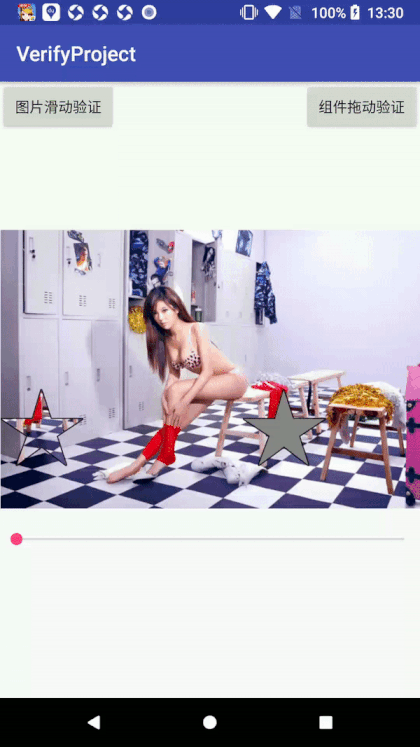

博客地址  https://blog.csdn.net/a940659387/article/details/80622104
###效果图



###实现方式
	
	
####滑块解锁
	
	自定义ImageView  在原图的基础上再画两个 滑块 一个目标位 一个移动位。
	通过一个对外方法可以更改进度 然后 调用postInvalidate() 实现该效果  
	大致原理就是这样 


该原理参考于 该文章：https://blog.csdn.net/u013904672/article/details/51279520  
对代码进行了部分优化  并设置了 seekbar只可拖动 不可点击。

####拖动验证

这个就是一个捕获一个View的ontouch事件来自己处理。然后不断更改 margin值  没什么难点。
项目中的按钮大小是写死的  不然需延迟获取view.getwidth()  在onCreate中 获取为0  因为在这里该View并没有绘制完成

核心代码也就ontouch里的方法 
```
img_start.setOnTouchListener(new View.OnTouchListener() {
            @Override
            public boolean onTouch(View view, MotionEvent event) {
                switch (event.getActionMasked()) {
                    case MotionEvent.ACTION_DOWN:
                        start_x = img_start.getLeft();
                        start_y = img_start.getTop();
                        end_y = img_end.getTop();
                        lastX = event.getRawX();
                        lastY = event.getRawY();
                        break;
                    case MotionEvent.ACTION_MOVE:
                        //  不要直接用getX和getY,这两个获取的数据已经是经过处理的,容易出现图片抖动的情况
                        move_x = (int) (event.getRawX()-lastX);
                        move_y = (int) (event.getRawY()-lastY);
                        int distancex = start_x + move_x;
                        int distancey = start_y + move_y;
                        layoutParams.setMargins(distancex, distancey, 0, 0);
                        img_start.setLayoutParams(layoutParams);
                        if(distancex>end_x&&distancex<(end_x+img_end.getWidth())&&distancey>end_y&&distancey<(end_y+img_end.getHeight())){
                            Log.e("check","true");
                            if(!isCheck){
                                isCheck = true;
                                img_end.setImageResource(R.drawable.img_aty_verify_end_check);
                            }
                        }else if(isCheck){
                            Log.e("check","false");
                            isCheck = false;
                            img_end.setImageResource(R.drawable.img_aty_verify_end);
                        }
                        break;
                    case MotionEvent.ACTION_UP:
                    case MotionEvent.ACTION_CANCEL:
                        if(isCheck){
                            img_start.setEnabled(false);
                            Toast.makeText(MainActivity.this,"success",Toast.LENGTH_SHORT).show();
                        }else {
                            img_end.setImageResource(R.drawable.img_aty_verify_end);
                            layoutParams.setMargins(start_x, start_y, 0, 0);
                            img_start.setLayoutParams(layoutParams);
                        }

                        break;
                }

                return true;
            }
        });
```
是不是很简单，只需要不断的更改params的margin就可以实现。

Over!!!
